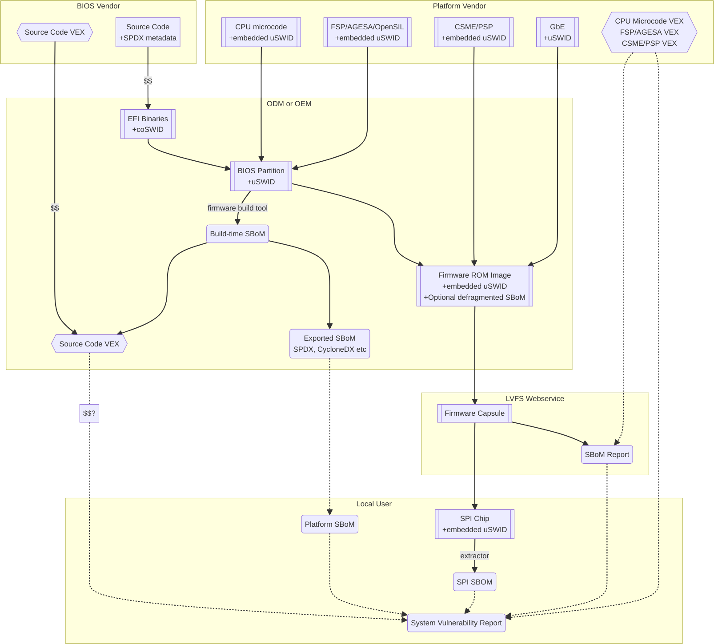

.. SPDX-License-Identifier: CC-BY-4.0

.. _chapter-information:

Information Flow
================

Introduction
------------

The figure below shows the possible flows of SBOM information from the *component vendor(s)*,
*firmware vendor(s)* and/or *platform vendor* to the end-user.
VEX data (see below) is used to notify the end user about security issues of components referenced
by the SBOM.

Depending on existing business relationships, the *firmware vendor* (the ODM) may take on some of
the responsibilities of the platform vendor (the OEM) or the *component vendor* (the IBV).

Dumping the SPI contents using an external SPI programmer or OS interface allows the end-user to
extract a “current” firmware SBOM.
This allows analyzing the image without having access to a public SBOM provided by the platform
vendor or a vendor neutral firmware provider like the `Linux Vendor Firmware Service <https://fwupd.org/>`_ (“LVFS”).

To comply with Executive Order 14028, OEM vendors **SHOULD** also publish either the SPDX or
CycloneDX SBOM export as a downloadable file on the public device webpage.
The SHA-256 checksum of the generated SBOM **SHOULD** be used as the unique collection ID for the
component and firmware SBOMs.
This enables the SBOM to be found using a search engine even if the original OEM has been renamed
or the device HTML URI has been modified.

Using VEX Rules
***************

Vulnerability Exploitability eXchange (VEX) allows a *component vendor* to assert the status of a
specific vulnerability in a particular firmware.
VEX can have any of the following “status” values for each component:

    **Not affected**
       No remediation is required regarding this vulnerability.

    **Not affected**
       No remediation is required regarding this vulnerability.
    **Affected**
       Actions are recommended to remediate or address this vulnerability.
    **Fixed**
       Represents that these product versions contain a fix for the vulnerability.
    **Under Investigation**
       It is not yet known whether these product versions are affected by the vulnerability.

Only the entity with the *source code* tree and the config files used to build it (usually the IBV
or ODM) has all the information required to know whether a given EFI binary is affected by a specific
vulnerability.

If our aim is to find out if a specific firmware is vulnerable to a specific security issue,
here are only three ways to solve this without access to a complete SBOM:

- The end-user asks the *component vendor*, who finds the firmware version, checks out the
  *source code* for that revision, then looks for affected code, and replies with the answer.
- The *component vendor* proactively passes detailed vulnerability status and remediation info to
  the immediate downstream supply chain partner, who then in turn proactively passes this down to
  each customer.
- The *component vendor* shares the code and the config to the customer and assumes the customer
  can work it out themselves.

We consider these ways to be clearly unsatisfactory.
Therefore, both *component vendors* and *platform vendors* **SHOULD** upload the SBOM to a trusted
neutral entity, allowing multiple customers and end-users to query the information.
The neutral entity **MAY** also process additional trusted VEX data directly from *component vendors*,
which allows *firmware* to automatically be marked as *affected* or *not affected* without direct
involvement of the *firmware vendor*.

Vendors writing VEX rules MUST use the same identifier as used in the SBOM.
VEX product IDs are specified using `PURL <https://en.wikipedia.org/wiki/Persistent_uniform_resource_locator>`_,
and the GUID **MUST** be used as the component name.
Where a semantic version is required it **MAY** also be specified.

For example:

- ``pkg:dca533ab-2c1f-4327-9b2b-09ac19533404``
- ``pkg:dca533ab-2c1f-4327-9b2b-09ac19533404@15.35.2039``

Further details about using Vulnerability Exploitability eXchange (VEX) standards such as OpenVEX
with embedded firmware SBOMs will be provided in the future.
